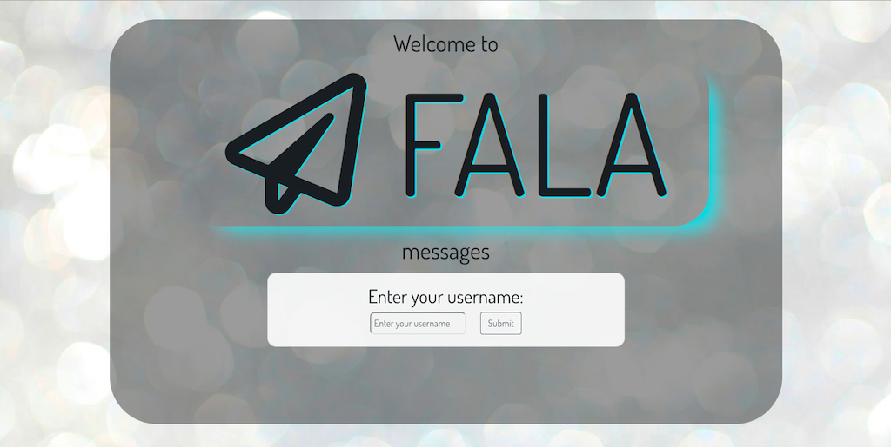
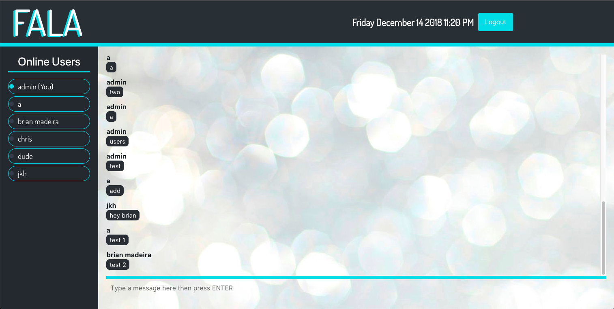

# Fala - a direct messaging application built with React

# Deployed on heroku: https://shrouded-island-48843.herokuapp.com/

Welcome to my messaging application.

I built this application because I wanted to strengthen my React app building skills. I used Pusher Chatkit to handle websockets and most of the backend in node and express, and used Bootstrap to help with some of the front end. I also added a small NPM called "react-live-clock" to display the current time.

The user will first be taken to this "login" page. Here they can enter any name they would like their username to be. 

After clicking submit, they will be taken to the main chatpage, where they can begin to speak with any user who is logged in. A list of users will be displayed on the left side of the screen and will indicate whether those users are currently online or offline. Near the bottom of the screen there is a typing indicator to display if a certain user is currently typing. The messages are persistent because they are stored in a cloud database.

I used media queries to make this app mobile responsive, specifically for iphone and Samsung Galaxy phones. 

## ("Fala" is portuguese for "speak" or "to speak"... a nod to my Brazilian heritage)

Thank you for viewing my application.

-Brian Madeira